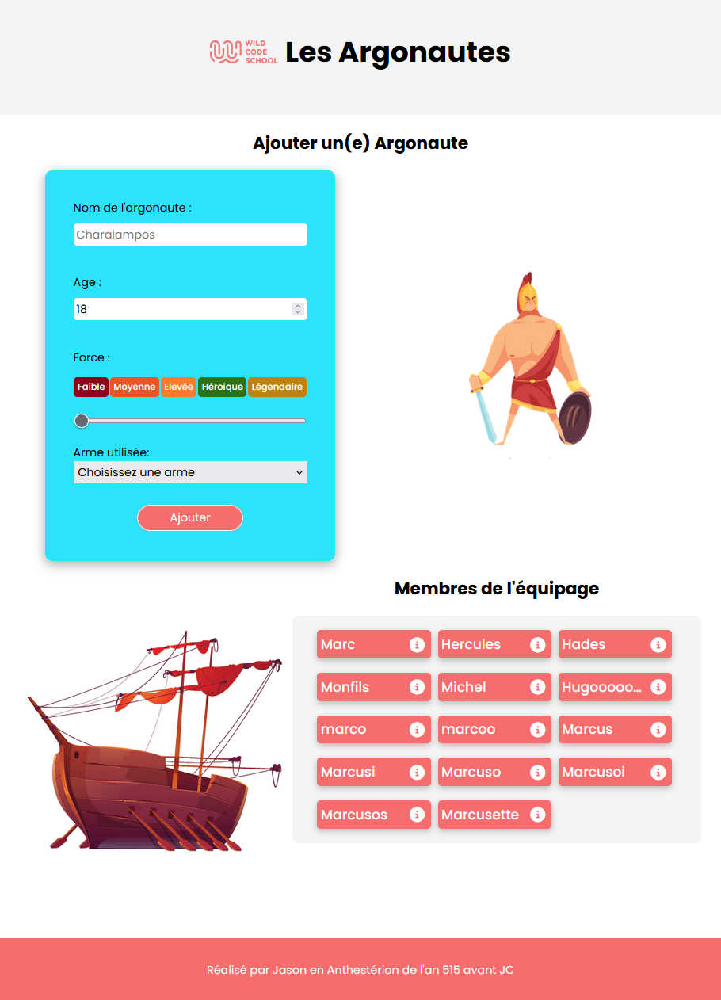

# Argonautes :fr:
## WildSchool project

___

:octocat: Made by : Julien Chanon

:date: Date : 19/10/2022

### Senario

Jason has to join Colchide and he has to sail thought the black see. He built a large boat for the expedition : the Argo. He has to find a crew, he needs 50 Argonauts to make things happen.
Jason asked me to build a dynamic App with a form where he could add candidates. 
___

## :wrench: How to start the project
1. Clone the repo or download the zip file.
2. Install `Node.js`(http://nodejs.org/).
3. Open your terminal.
4. Switch to the `/backend` folder.
5. Install the project dependencies `npm install`.
6. If the file .env is provided, add it to the root of `/backend` folder.
7. At this point you can run the Node server with the commande `npm start`.
8. Switch to the `/frontend` folder.
9. Install the frontend dependencies `npm install`.
10. Run React with the following commande `npm start`.
11. Open your favorite browser and at this point you should be able to try the App with the following URL http://localhost:3000/ :rocket:

___

## Do you want the see more?

You are welcome to visit my portfolio at http://julien-chanon.fr/ where you will find more of my projects and who am I.